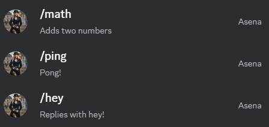
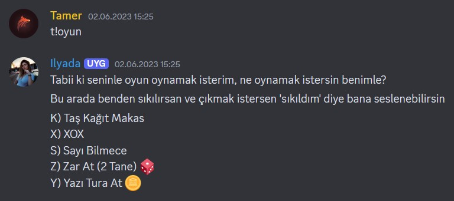
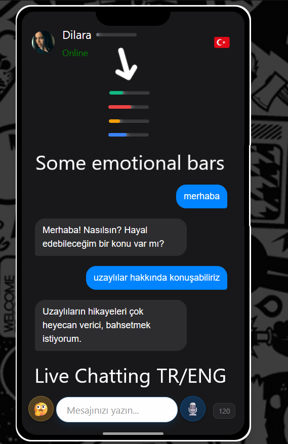
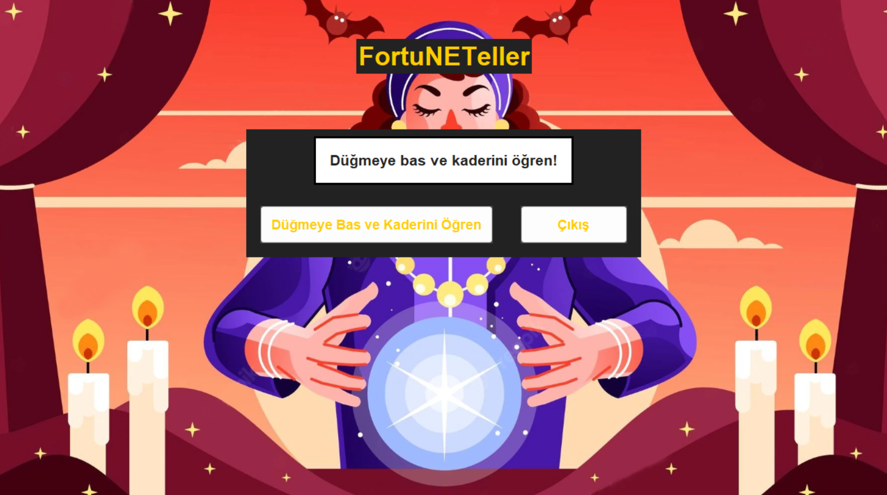
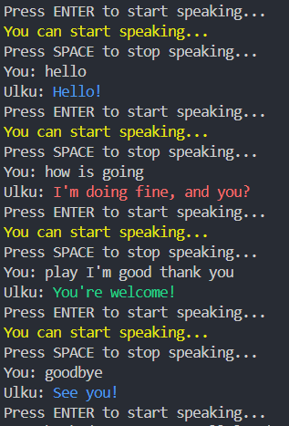

# MyBots - Bot Projeleri Koleksiyonu

Bu repository, farklı platformlar ve teknolojiler kullanılarak geliştirilmiş çeşitli bot projelerini içermektedir. Discord botları, web sohbet botları, masaüstü uygulamaları ve sesli sohbet botları bulunmaktadır.

## 📋 İçindekiler

- [Discord Botları](#discord-botları)
  - [Asena](#asena)
  - [Ilyada](#ilyada)
- [Web Sohbet Botu](#web-sohbet-botu)
- [Masaüstü Uygulamaları](#masaüstü-uygulamaları)
  - [FortuNETeller](#fortuneteller)
- [Sesli Sohbet Botu](#sesli-sohbet-botu)

---

## 🤖 Discord Botları

### Asena



**Teknoloji:** Node.js, Discord.js v14

Asena, modern Discord.js kütüphanesi kullanılarak geliştirilmiş bir Discord botudur. Slash komutları ve interaksiyon tabanlı bir yapıya sahiptir.

#### Özellikler:
- Slash komutları (`/hey`, `/ping`, `/math`)
- Matematik işlemleri (toplama, çıkarma, çarpma, bölme)
- Mesaj tabanlı komutlar (`hello`)

#### Kurulum

```bash
cd DiscordBots/Asena
npm install
```

#### Yapılandırma

`.env` dosyası oluşturun:
```
TOKEN=your_discord_bot_token
CLIENT_ID=your_client_id
GUILD_ID=your_guild_id
```

#### Çalıştırma

```bash
# Komutları kaydetmek için
node src/register-commands.js

# Botu başlatmak için
node src/app.js
```

---

### Ilyada



**Teknoloji:** Python, discord.py

Ilyada, eğlenceli özellikler ve interaktif komutlar sunan bir Discord botudur. Fal bakma, oyunlar ve sesli kanal desteği içerir.

#### Özellikler:
- **Fal Komutu** (`t!fal`) - Rastgele fal mesajları
- **Oyunlar:**
  - Taş-Kağıt-Makas
  - Sayı Bilmece (0-20 arası)
  - Zar Atma (2 zar)
  - Yazı-Tura
- **Sesli Komutlar:**
  - `t!katıl` - Sesli kanala katılma
  - `t!çık` - Sesli kanaldan ayrılma
- **Kullanıcı Bilgileri** (`t!bilgi [kullanıcı]`)
- **Özel Komutlar:** `t!merhaba`, `t!nasılsın`, `t!seniseviyorum`, `t!kimsin`
- **Sunucu Olayları:** Yeni üye karşılama ve ayrılma mesajları

#### Kurulum

```bash
cd DiscordBots/Ilyada
pip install discord.py colorama
```

#### Yapılandırma

`bot.py` dosyasında bot token'ınızı güncelleyin:
```python
client.run("YOUR_DISCORD_BOT_TOKEN")
```

#### Çalıştırma

```bash
python bot.py
```

---

## 🌐 Web Sohbet Botu



**Teknoloji:** Next.js 15, React 19, OLLAMA, Tailwind CSS, SCSS

Modern bir web tabanlı sohbet botu uygulaması. Duygu algılama, çok dilli destek (Türkçe/İngilizce) ve OLLAMA entegrasyonu ile akıllı yanıtlar üretir.

### Özellikler:

- **Duygu Algılama:** Mesajlardan kullanıcının duygusal durumunu analiz eder
  - Mutluluk, üzüntü, öfke, kaygı, stres, yorgunluk, hayal kırıklığı, minnettarlık
  - EWMA (Exponentially Weighted Moving Average) ile duygu takibi
  - Duygu durumuna göre dinamik yanıt tonu
- **OLLAMA Entegrasyonu:** Yerel LLM ile doğal dil işleme
  - Model: `qwen2.5:3b-instruct` (varsayılan)
  - Konuşma geçmişi takibi
  - Slot extraction (isim, vb. bilgiler)
- **Çok Dilli Destek:** Türkçe ve İngilizce
- **Emoji Picker:** Mesajlara emoji ekleme
- **Karakter Sistemi:** 
  - Türkçe: Dilara
  - İngilizce: Sofia
- **Duygu Göstergesi:** Görsel duygu durumu çubuğu
- **120 Karakter Limiti:** Mesaj uzunluk kontrolü

### Kurulum

```bash
cd WebChatBot
npm install
```

### Yapılandırma

OLLAMA'nın çalıştığından emin olun:
```bash
# OLLAMA'yı başlatın (localhost:11434)
ollama serve
```

İsteğe bağlı olarak `.env.local` dosyası oluşturun:
```
NEXT_PUBLIC_OLLAMA_URL=http://localhost:11434
NEXT_PUBLIC_OLLAMA_MODEL=qwen2.5:3b-instruct
```

### Çalıştırma

```bash
# Geliştirme modu
npm run dev

# Production build
npm run build
npm start
```

Uygulama `http://localhost:3000` adresinde çalışacaktır.

### Teknik Detaylar

- **Emotion Detection:** Lexicon tabanlı duygu algılama sistemi
- **Intent Recognition:** 30+ intent kategorisi
- **Response Generation:** OLLAMA ile context-aware yanıt üretimi
- **Fallback System:** OLLAMA erişilemezse doğal fallback yanıtları

---

## 🖥️ Masaüstü Uygulamaları

### FortuNETeller



**Teknoloji:** Python, Tkinter

Tkinter ile geliştirilmiş masaüstü fal bakma uygulaması. Türkçe ve İngilizce dil desteği ile 48 farklı fal mesajı içerir.

#### Özellikler:
- Modern GUI tasarımı
- Çok dilli destek (Türkçe/İngilizce)
- 48 farklı fal mesajı
- Arka plan görseli
- Sistem diline göre otomatik dil seçimi

#### Kurulum

```bash
cd FortuNETeller
pip install tkinter
```

#### Çalıştırma

```bash
python main.py
```

#### Dil Dosyaları

- `assets/language/tr.json` - Türkçe fal mesajları
- `assets/language/eng.json` - İngilizce fal mesajları

---

## 🎤 Sesli Sohbet Botu



**Teknoloji:** Python, Speech Recognition, Colorama

Sesli giriş ile çalışan interaktif sohbet botu. Mikrofon üzerinden konuşma tanıma ve metin tabanlı yanıt üretimi.

### Özellikler:

- **Sesli Giriş:** Enter tuşu ile kayıt başlatma, Space tuşu ile durdurma
- **Konuşma Tanıma:** Google Speech Recognition API
- **Akıllı Yanıtlar:** Pattern matching ile intent tanıma
- **Renkli Çıktı:** Terminal'de renkli mesajlar
- **Konuşma Geçmişi:** Sohbet bağlamı takibi
- **Takip Soruları:** %20 şansla takip sorusu sorma

### Kurulum

```bash
cd TextChatBot
pip install speechrecognition keyboard colorama
```

### Çalıştırma

```bash
python brain.py
```

### Kullanım

1. Program başladığında "Press ENTER to start speaking..." mesajı görünecek
2. ENTER tuşuna basın ve konuşmaya başlayın
3. Konuşmanızı bitirdikten sonra SPACE tuşuna basın
4. Bot yanıtınızı işleyip renkli bir yanıt verecektir

### Desteklenen Komutlar

- Selamlama: "hello", "hi", "hey"
- Nasılsın: "how are you", "nasılsın"
- Teşekkür: "thank you", "thanks"
- Veda: "bye", "goodbye"
- Ve daha fazlası...

---

## 📁 Proje Yapısı

```
MyBots/
├── DiscordBots/
│   ├── Asena/          # Node.js Discord botu
│   └── Ilyada/         # Python Discord botu
├── WebChatBot/         # Next.js web sohbet botu
├── FortuNETeller/      # Tkinter masaüstü uygulaması
├── TextChatBot/        # Sesli sohbet botu
└── Img/                # Bot görselleri
```

---

## 🛠️ Gereksinimler

### Genel
- Python 3.10+ (Python projeleri için)
- Node.js 18+ (Node.js projeleri için)
- npm veya yarn

### Discord Botları
- Discord Bot Token
- Discord Developer Portal hesabı

### Web Sohbet Botu
- OLLAMA (yerel LLM çalıştırmak için)
- Modern web tarayıcısı

### Sesli Sohbet Botu
- Mikrofon erişimi
- İnternet bağlantısı (Google Speech Recognition için)

---

## 📝 Lisans

Bu projeler MIT lisansı altında lisanslanmıştır. Detaylar için `LICENSE.md` dosyasına bakın.

---

## 🤝 Katkıda Bulunma

1. Bu repository'yi fork edin
2. Feature branch oluşturun (`git checkout -b feature/AmazingFeature`)
3. Değişikliklerinizi commit edin (`git commit -m 'Add some AmazingFeature'`)
4. Branch'inizi push edin (`git push origin feature/AmazingFeature`)
5. Pull Request oluşturun

---

## 📧 İletişim

Sorularınız veya önerileriniz için issue açabilirsiniz.

---

## 🎯 Gelecek Planlar

- [ ] Discord botlarına daha fazla özellik ekleme
- [ ] Web sohbet botuna sesli giriş desteği
- [ ] Mobil uygulama versiyonları
- [ ] Daha fazla dil desteği
- [ ] AI model optimizasyonları

---

**Not:** Tüm botlar eğitim ve kişisel kullanım amaçlıdır. Production ortamında kullanmadan önce güvenlik kontrollerini yapmayı unutmayın.
